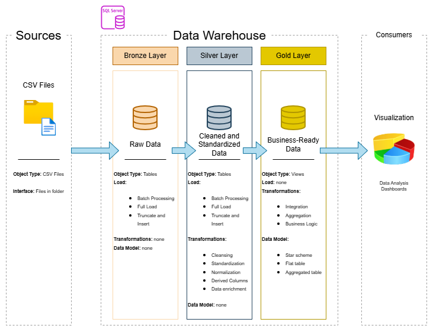

# Data-Warehouse-Project
Building a Data Warehouse from CSV files to expand knowledge and gain experience in data engineering.

## Documentation
Our documentation is located in the Documentation folder where all documents and diagrams are stored. The following is mainly a broad overview and a list of links to the relevant resources.

### Architecture Diagram

### Naming Conventions
Our Naming Conventions can be found [here](Documentation/naming_conventions.md).

